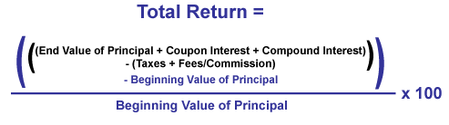
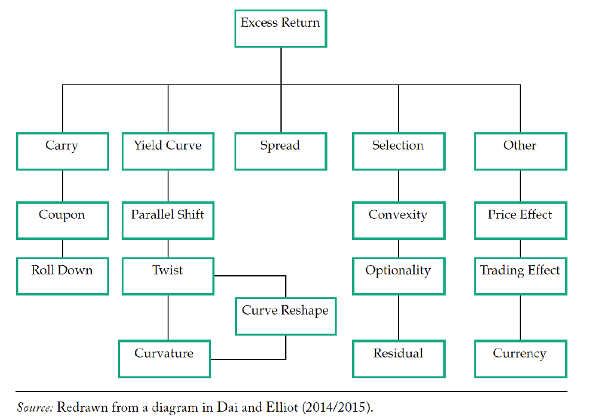

# Performance Attribution

Performance Attribution is the analysis of a portfolio's return against another portfolio. Typically, the comparison portfolio 
is a benchmark published by an Index provider such as Bloomberg or Standard & Poors. The goal of the analysis is to explain 
the performance differences across a range of factors in order to isolate the active, passive, and environmental effects on 
portfolio performance.

## Top-Level Explanation of Performance

"Performance" is defined as the return of a portfolio, measured both on an as-reported and risk-weighted basis.

In the case of equity portfolios, risk-weighted analysis includes such measures as Sharpe, Treynor, Jensen, Modigliani and 
Modigliani, and Treynor Squared.

For bond portfolios, the methodology for performance attribution is highly specialized and is a heavy computational burden. 
Most vendors will claim that 'Performance Attribution is Hard to Implement'(FactSet reference), but Fite Analytics' 
cloud platform executes the calculations with speed.

### Total Return

#### Excess Return

