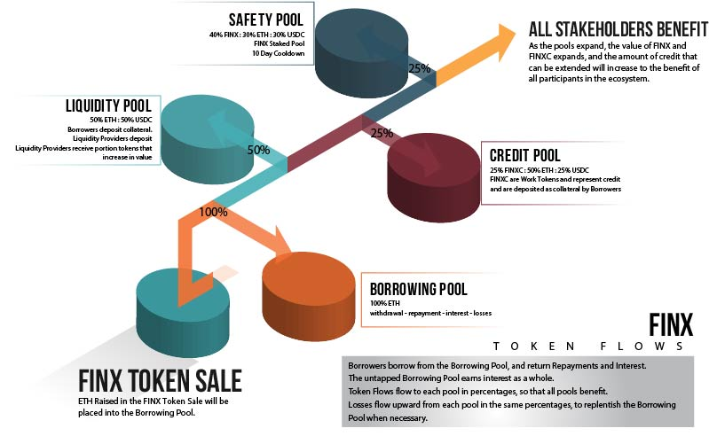

FINX is an automated liquidity protocol that is powered by a <Link to="/docs/v2/protocol-overview/glossary/#credit-risk-formula">credit risk formula</Link> 
and implemented in a system of non-upgradeable smart contracts on the [Ethereum](https://ethereum.org/) blockchain.

The primary purpose of FINX is to provide an Ethereum corporate credit facility as an extension to Collateralized Loan 
protocols with Credit Pools on the [Ethereum](https://ethereum.org/) blockchain.

FINX provides a role for Underwriters, Guarantors and Other Stakeholders to facilitate Credit on 
Decentralized Finance ("DeFi"). FINXC tokens constitute a Decentralized Ecosystem for providers of Credit Facilities, 
which are used as Guarantees against Collateralized Pools and Money Markets provided by Uniswap, Aave, and others. 
Insurers, Underwriters, Credit Professionals, Ratings Agencies, and other Stakeholders can participate in the construction 
of credit pools, providing credit facilities to be used where underwriting is required.

### FINX Token Flow

The ecosystem works as a structured arrangement of various pools. When credit is repaid, all pools benefit as the repayments 
flow down to the pools. When losses are incurred, they are replaced (backed) by the same pools, which flow upward to replentish 
the lost balance.

Each pool has a specific token ratio that is maintained and provides liquidity, swap fee generation, and yield on both staked 
rewards and interest.
