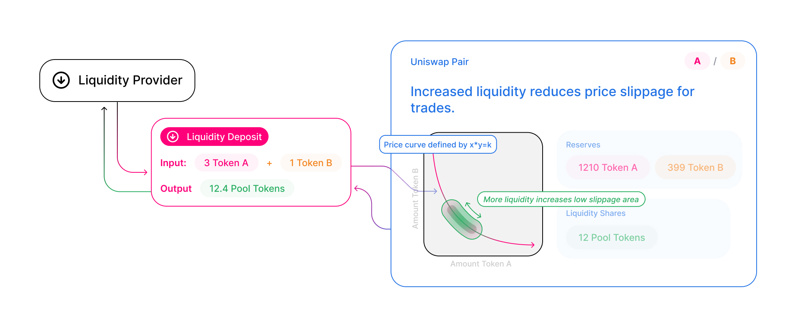

FINX is an automated liquidity protocol that is powered by a <Link to="/docs/v2/protocol-overview/glossary/#credit-risk-formula">credit risk formula</Link> 
and implemented in a system of non-upgradeable smart contracts on the [Ethereum](https://ethereum.org/) blockchain.

The primary purpose of FINX is to provide _**Non-Collateralized**_ Credit Pools on the [Ethereum](https://ethereum.org/) blockchain.

FINX provides a role for Underwriters, Guarantors and Other Stakeholders to facilitate Credit on 
Decentralized Finance ("DeFi"). FINX contracts constitute a Decentralized Ecosystem for providers of Credit Facilities, 
which are used as Guarantees against Collateralized Pools and Money Markets provided by Uniswap, Aave, Balancer, and Compound contracts. Insurers, Underwriters, Credit Professionals, Ratings Agencies, and other Stakeholders can participate in the credit pools, providing credit facilities to be used in place of collateral.

FINX prioritizes decentralization, censorship resistance, and security.

FINX is open-source software licensed under the GPL.

Each FINX credit pool smart contract manages a liquidity pool made up of reserves of several ERC-20 tokens.

Anyone can become a participant in the credit pool as one (or all) of 3 Roles:

### Liquidity Provider

Liquidity Providers may deposit [ERC-20](https://eips.ethereum.org/EIPS/eip-20) tokens in one of 2 types of pools:

1. Debt Facility Pools
2. Liquidity Swap Pair Pools

### Borrower (Corporation)

Borrowers may borrow (withdraw) [ERC-20](https://eips.ethereum.org/EIPS/eip-20) tokens from Debt Facility Pools, paying 
market interest on the tokens. Pools will be available in a range of durations and with varying characteristics so as to 
meet the demands of institutional portfolio managers and investors.

### Credit Facility Service Provider (Stakeholder)

Credit Facility Service Providers are firms that Guarantee the Debt Facility Pool in one way or another. Depending on the 
tokenomics involved and the type of pool, various Credit Facility Service Providers will provide tokenized
guarantees which are attached to the Loan Contract. Types of providers are:

1. Ratings Agencies
2. Underwriters
3. Collateral Valuators
4. Insurance Providers
5. Audit and Compliance Certifications

Pairs act as automated market makers, standing ready to accept one token for the other as long as the “constant product” formula is preserved. This formula, most simply expressed as `x * y = k`, states that trades must not change the product (`k`) of a pair’s reserve balances (`x` and `y`). Because `k` remains unchanged from the reference frame of a trade, it is often referred to as the invariant. This formula has the desirable property that larger trades (relative to reserves) execute at exponentially worse rates than smaller ones.

In practice, FINX applies a 0.30% fee to one-sided pool positions and trades, which is added to reserves. As a result, each trade actually increases `k`. This functions as a payout to LPs, which is realized when they burn their pool tokens to withdraw their portion of total reserves. In the future, this fee may be reduced to 0.25%, with the remaining 0.05% withheld as a protocol-wide charge.

Because the relative price of the two pair assets can only be changed through trading, divergences between the Uniswap price and external prices create arbitrage opportunities. This mechanism ensures that Uniswap prices always trend toward the market-clearing price.

# Further reading

To see how token swaps work in practice, and to walk through the lifecycle of a swap, check out <Link to="/docs/v2/core-concepts/swaps">Swaps</Link>. Or, to see how liquidity pools work, see <Link to="/docs/v2/core-concepts/pools">Pools</Link>.

Ultimately, of course, the Uniswap protocol is just smart contract code running on Ethereum. To understand how they work, head over to <Link to="/docs/v2/protocol-overview/smart-contracts/">Smart Contracts</Link>.
