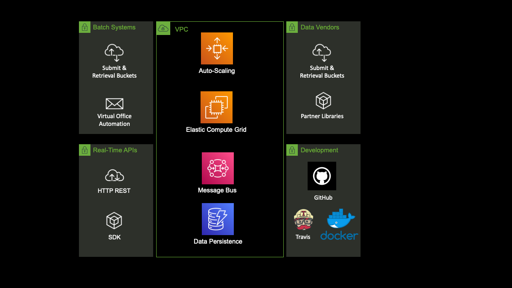

# Fite Analytics Technology Architecture

## Top-Level Design

We use Amazon Web Services ([AWS](https://aws.amazon.com)) as our cloud partner. Several times per day we ingest 
large amounts of security data updates and we ingest it into our platform data repositories. We make this data available 
with ultra-low latency to our calculation engines which run on a parallel compute grid.

Our APIs connect directly to the parallel compute grid where on-demand calculations are made and results returned 
requester. APIs may include calculation-intensive routines such as long-date maturity cash flow forecasts, rate shock 
simulations, and key rate duration computations, and in cases where http request may last more than a few seconds we use websockets.

The batch service ingests large (or small) lists of security identifiers, generally CUSIP or ISIN, along with the date 
for the analysis and the price at which the analytics should be run. Based on this limited input dataset the platform is 
able to retrieve all relevant security information, perform calculations and return the result sets in a large file. The batch 
process runs quickly relative to competitive offerings, generally running hundreds of thousands of securities in less than 
1 hour.

Our software is written in C++, Python, Javascript, Typescript and Go. All of our code is written in-house and we 
do not use external companies for development.

## Technical Details

Some of our code is available as open source software under GPL 3.0 that can be forked into your own project. Our calculations and data processing 
routines, database structures and other proprietary information are the intellectual property of Fite Analytics LLC 
and are not included in public repositories.

For information on the technical details of the Fite Analytics platform, please [contact us](mailto:info@fiteanalytics.com).

