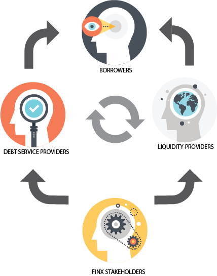

The FINX ecosystem is primarily comprised of four types of participants: Liquidity Providers, Borrowers, Debt Service 
Providers and Stakeholders. Additionally, we encourage developers to expand the credit risk space with additional protocols.

In total, interactions between these classes create a positive feedback loop, fueling digital economies by defining a common language through which tokens can be pooled, traded and used.

# Liquidity Providers

# Borrowers

# Credit Facility Service Providers

# FINX Stakeholders

# Developers

# FINX Team and Community

The FINX team along with the broader FINX community drives development of the protocol and ecosystem.
